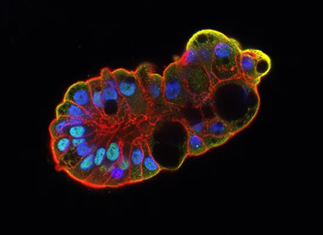
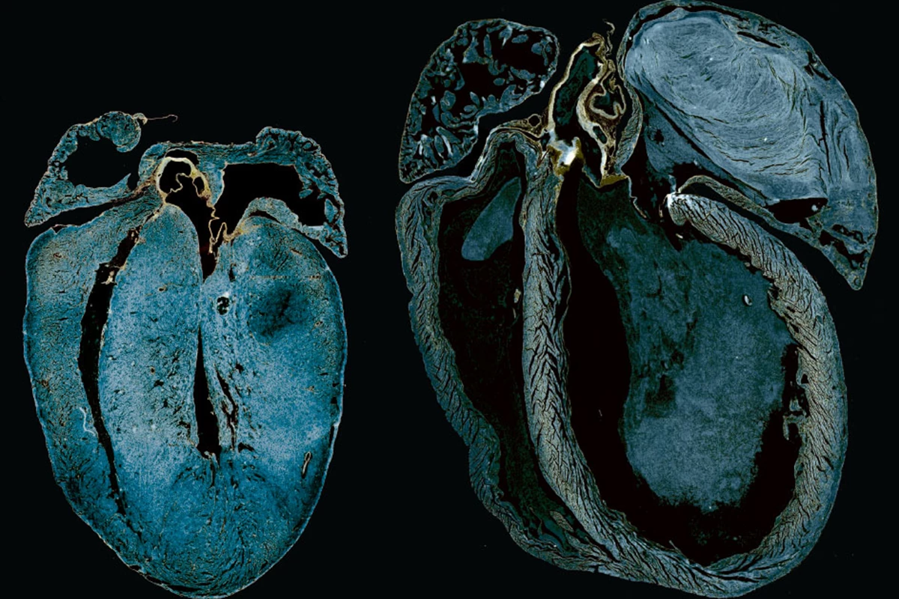

I am currently a 4th-year undergraduate students working on independent 
research projects with the following labs:

### [Dr. Amy Wong's Lab](https://lab.research.sickkids.ca/wong/)

I am interested in comprehending the cellular developmental trajectories during 
human lung development at a single-cell resolution. This endeavour aims to 
elucidate the lineages of basal stem cells within a proximal iPSC model. 
Additionally, I employ gene-editing technologies to create a reporter cell 
line for distal lung development and maturation.

### [Dr. Paul Delgado-Olguin's Lab]

(:class="img-responsive")

I primarily investigate the dynamics of genome organization in cardiomyocytes 
using high-throughput genomic and transcriptomic approaches to understand the 
regulatory mechanisms of heart development and regeneration. I also develop
and characterize a new model of pediatric heart failure.